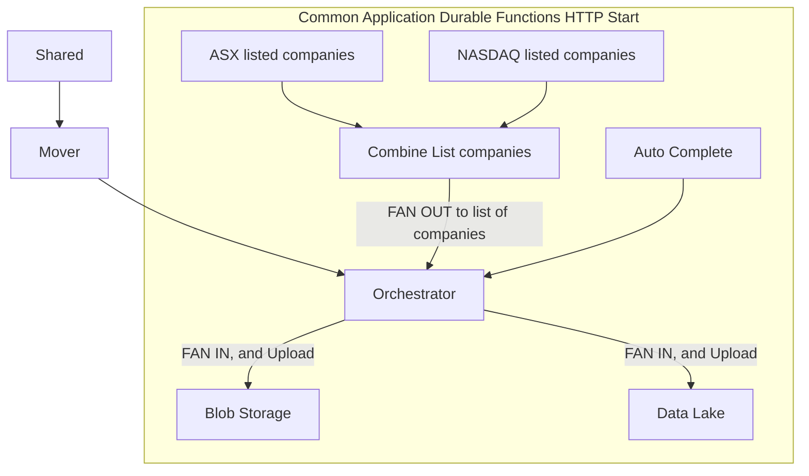

# Yahoo Finance Common Application API Document

## Establish Global variables for Azure CLI
```
# Define the region for Application services
$service_location= <define your server location>

# Define the resource group used
$resource_group_name = <define your resource group name>

# Define the email user name for admin access 
$user_email= <define your user email address>

# Define the Blob's production container name
$abs_container_name= <define your blob storage production container name> 

# Define the Blob's archive container name
$abs_archive_container_name= <define your blob storage archive container name>

# Extract the blob storage account Id through Azure CLI
$storage_acct_id=$(az storage account show --name $storage_acct_name --resource-group $resource_group_name --query 'id' --output tsv)

# Extract the blob storage account key through Azure CLI
$storage_acct_key1=$(az storage account keys list --resource-group 
$resource_group_name --account-name $storage_acct_name --query [0].value --output tsv)

# Define the production Data Lake 
$adls_acct_name= <define your datalake account name> 
$fsys_name= <define your file root name>
$dir_name= <sub directory>

# Extract the datalake storage account key through Azure CLI
$adls_acct_key1=$(az storage account keys list --resource-group $resource_group_name --account-name $adls_acct_name --query [0].value --output tsv)

# Define the key vault name
$key_vault_name= <define your key vault name>

# Define the blob secret name
$abs_secret_name= <define your blob storage secrets name>

# Define the Data Lake secret name
$adls_secret_name= <define your data lake storage secrets name>

# Define the function application name
$funcapp_name= <define your Azure function application name>
```

## Create a new repository in Github
```
# git clone to the project root
git clone <url>
```
## Create a Azure function app
```
# Create a function project in the desired folder
# Make sure your are in the right folder directory
func init commonApp --python

# Create Python virual environment
python -m venv .venv 

# Activate Python virtual environment
...venv\Scripts\activate
````

## Configure host.json file
```
# Open the host.json file and add function Time out limit
## Set to 3 hours
{
    "functionTimeout": "03:00:00"
}
```
## Configure the local.settings.json file
```
# Open the local.settings file and the following
{
    "ABS_SECRET_NAME": "abs-access-key1" <define your blob secret name stored in the secret valult>,
    "ADLS_SECRET_NAME": "adls-access-key1" <define your data lake secret name stored in the secret vault> ,
    "KEY_VAULT_NAME": "kvmarketfinance" <define your key vault name>,
    "X_RAPIDAPI_HOST": "x-rapidapi-host" <define your X_RAPIDAPI_HOST name>,
    "X_RAPIDAPI_KEY": "x-rapidapi-key <define your X_RAPIDAPI_KEY>"
}
```

## Setup and Configure variables for Azure function environment
```
az functionapp config appsettings set --name $funcapp_name --resource-group $resource_group_name --settings "KEY_VAULT_NAME=kvmarketfinance"
az functionapp config appsettings set --name $funcapp_name --resource-group $resource_group_name --settings "ABS_SECRET_NAME=abs-access-key1"
az functionapp config appsettings set --name $funcapp_name --resource-group $resource_group_name --settings "ADLS_SECRET_NAME=adls-access-key1"
az functionapp config appsettings set --name $funcapp_name --resource-group $resource_group_name --settings "X_RAPIDAPI_HOST= x-rapidapi-host"
az functionapp config appsettings set --name $funcapp_name --resource-group $resource_group_name --settings "X_RAPIDAPI_KEY= x-rapidapi-key"
```

## Common app flow diagram



